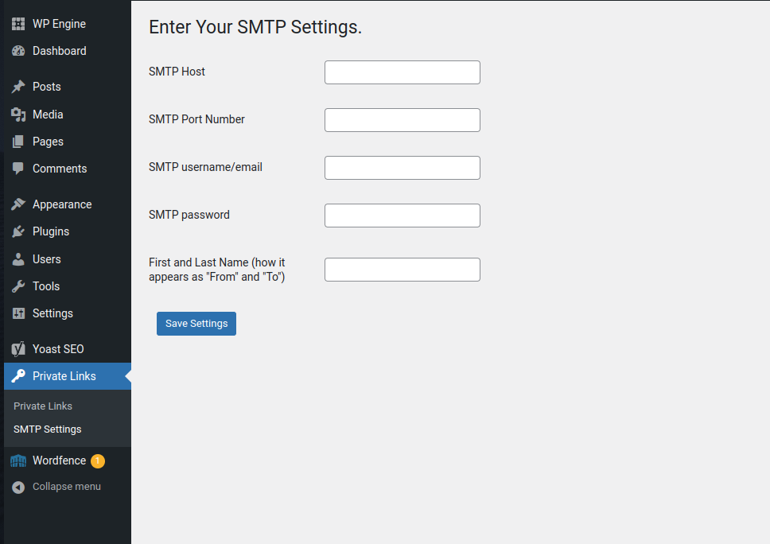

<!-- PROJECT SHIELDS -->

<!-- PROJECT LOGO -->
 

  

<h3 align="center">Private Links</h3>

  

   Generate one-time-use links that expire after 24 hours. 
     
    <a href="https://github.com/mjones129/private-links"><strong>Explore the docs »</strong></a>
     
     
    <a href="https://github.com/mjones129/private-links">View Demo</a>
    ·
    <a href="https://github.com/mjones129/private-links/issues/new?labels=bug&template=bug-report---.md">Report Bug</a>
    ·
    <a href="https://github.com/mjones129/private-links/issues/new?labels=enhancement&template=feature-request---.md">Request Feature</a>
  

<!-- TABLE OF CONTENTS -->

  
Table of Contents

  <ol>
    <li>
      <a href="#about-the-project">About The Project</a>
      <ul>
        <li><a href="#built-with">Built With</a></li>
      </ul>
    </li>
    <li>
      <a href="#getting-started">Getting Started</a>
      <ul>
        <li><a href="#prerequisites">Prerequisites</a></li>
        <li><a href="#installation">Installation</a></li>
      </ul>
    </li>
    <li><a href="#usage">Usage</a></li>
    <li><a href="#roadmap">Roadmap</a></li>
    <li><a href="#contributing">Contributing</a></li>
    <li><a href="#license">License</a></li>
    <li><a href="#contact">Contact</a></li>
    <li><a href="#acknowledgments">Acknowledgments</a></li>
  </ol>

<!-- ABOUT THE PROJECT -->
## About The Project

[![Private Links Screen Shot][product-screenshot]](https://example.com)

(<a href="#readme-top">back to top</a>)

### Built With

* 
* 

(<a href="#readme-top">back to top</a>)

<!-- GETTING STARTED -->
## Getting Started

This is a WordPress plugin that allows you to send SMTP authenticated emails that contain private links.
When the link is sent to the recipiant, the page only becomes accessible via the private link.
The link is only useable once in 24 hours. Attempts to access protected pages without the access token,
with an expired token, or a token that has already been used will be denied.

### Prerequisites

This is an example of how to list things you need to use the software and how to install them.
* WordPress 6.5.5 or higher

### Installation

1. Download the `private-links.zip` from the Releases section.

2. Plugins page > Add New > Upload

3. Install & Activate

(<a href="#readme-top">back to top</a>)

<!-- USAGE EXAMPLES -->
## Usage

In order to successfully send emails, you'll first need to set up your SMTP credentials. You can do this from the SMTP Settings page.

After your SMTP credentials have been successfully saved, you are now ready to send private links. To send an email containing a private link, simply click "Private Links" and fill out the all the fields. 

_For more examples, please refer to the [Documentation](https://example.com)_

(<a href="#readme-top">back to top</a>)

<!-- ROADMAP -->
## Roadmap

- [ ] Add a BCC field 
- [ ] Add email notifications when private links are clicked
- [ ] Schedule emails for later delivery 

See the [open issues](https://github.com/mjones129/private-links/issues) for a full list of proposed features (and known issues).

(<a href="#readme-top">back to top</a>)

<!-- CONTRIBUTING -->
## Contributing

Contributions are what make the open source community such an amazing place to learn, inspire, and create. Any contributions you make are **greatly appreciated**.

If you have a suggestion that would make this better, please fork the repo and create a pull request. You can also simply open an issue with the tag "enhancement".
Don't forget to give the project a star! Thanks again!

1. Fork the Project
2. Create your Feature Branch (`git checkout -b feature/AmazingFeature`)
3. Commit your Changes (`git commit -m 'Add some AmazingFeature'`)
4. Push to the Branch (`git push origin feature/AmazingFeature`)
5. Open a Pull Request

(<a href="#readme-top">back to top</a>)

<!-- LICENSE -->
## License

Distributed under the MIT License. See `LICENSE.txt` for more information.

(<a href="#readme-top">back to top</a>)

<!-- CONTACT -->
## Contact

Project Link: [https://github.com/mjones129/private-links](https://github.com/mjones129/private-links)

(<a href="#readme-top">back to top</a>)

<!-- MARKDOWN LINKS & IMAGES -->
<!-- https://www.markdownguide.org/basic-syntax/#reference-style-links -->
[contributors-shield]: https://img.shields.io/github/contributors/mjones129/private-links.svg?style=for-the-badge
[contributors-url]: https://github.com/mjones129/private-links/graphs/contributors
[forks-shield]: https://img.shields.io/github/forks/mjones129/private-links.svg?style=for-the-badge
[forks-url]: https://github.com/mjones129/private-links/network/members
[stars-shield]: https://img.shields.io/github/stars/mjones129/private-links.svg?style=for-the-badge
[stars-url]: https://github.com/mjones129/private-links/stargazers
[issues-shield]: https://img.shields.io/github/issues/mjones129/private-links.svg?style=for-the-badge
[issues-url]: https://github.com/mjones129/private-links/issues
[license-shield]: https://img.shields.io/github/license/mjones129/private-links.svg?style=for-the-badge
[license-url]: https://github.com/mjones129/private-links/blob/master/LICENSE.txt
[linkedin-shield]: https://img.shields.io/badge/-LinkedIn-black.svg?style=for-the-badge&logo=linkedin&colorB=555
[linkedin-url]: https://linkedin.com/in/linkedin_username
[product-screenshot]: images/screenshot1.png
[Next.js]: https://img.shields.io/badge/next.js-000000?style=for-the-badge&logo=nextdotjs&logoColor=white
[Next-url]: https://nextjs.org/
[React.js]: https://img.shields.io/badge/React-20232A?style=for-the-badge&logo=react&logoColor=61DAFB
[React-url]: https://reactjs.org/
[Vue.js]: https://img.shields.io/badge/Vue.js-35495E?style=for-the-badge&logo=vuedotjs&logoColor=4FC08D
[Vue-url]: https://vuejs.org/
[Angular.io]: https://img.shields.io/badge/Angular-DD0031?style=for-the-badge&logo=angular&logoColor=white
[Angular-url]: https://angular.io/
[Svelte.dev]: https://img.shields.io/badge/Svelte-4A4A55?style=for-the-badge&logo=svelte&logoColor=FF3E00
[Svelte-url]: https://svelte.dev/
[Laravel.com]: https://img.shields.io/badge/Laravel-FF2D20?style=for-the-badge&logo=laravel&logoColor=white
[Laravel-url]: https://laravel.com
[Bootstrap.com]: https://img.shields.io/badge/Bootstrap-563D7C?style=for-the-badge&logo=bootstrap&logoColor=white
[Bootstrap-url]: https://getbootstrap.com
[JQuery.com]: https://img.shields.io/badge/jQuery-0769AD?style=for-the-badge&logo=jquery&logoColor=white
[JQuery-url]: https://jquery.com 
