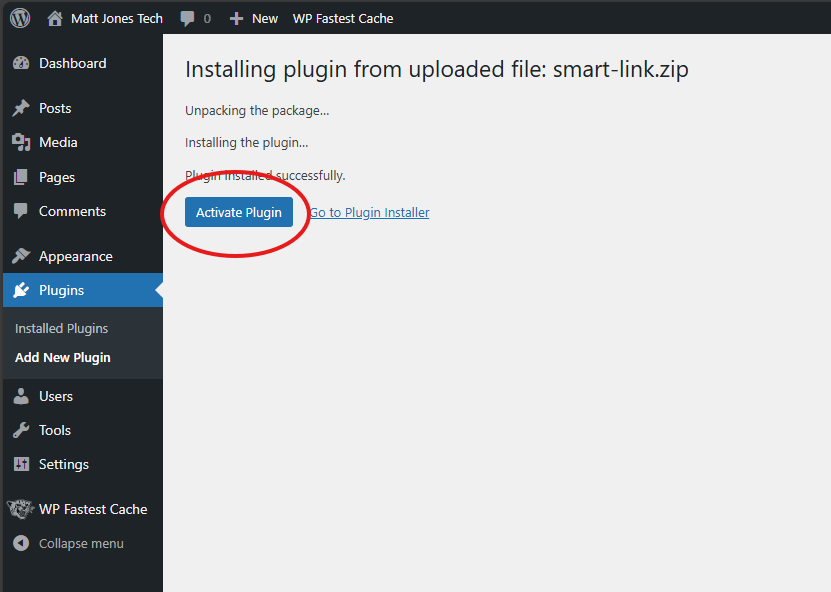

<!-- PROJECT SHIELDS -->

<!-- PROJECT LOGO -->
 

  

<h3 align="center">Smart Link Pro</h3>

  

   Generate single-use links that expire after 24 hours.
     
    <a href="https://github.com/mjones129/smart-link"><strong>Explore the docs »</strong></a>
     
     
    <a href="https://smartlinkpro.io/">View Demo</a>
    ·
    <a href="https://github.com/mjones129/smart-link/issues/new?labels=bug&template=bug-report---.md">Report Bug</a>
    ·
    <a href="https://github.com/mjones129/smart-link/issues/new?labels=enhancement&template=feature-request---.md">Request Feature</a>
  

<!-- TABLE OF CONTENTS -->

  
Table of Contents

  <ol>
    <li>
      <a href="#about-the-project">About The Project</a>
    </li>
    <li>
      <a href="#installation">Installation</a>
    </li>
    <li><a href="#usage">Usage</a></li>
    <li><a href="#contributing">Contributing</a></li>
    <li><a href="#license">License</a></li>
    <li><a href="#contact">Contact</a></li>
  </ol>

<!-- ABOUT THE PROJECT -->
## About The Project

[![Product Name Screen Shot][product-screenshot]](https://smartlinkpro.io)

Smart Link is a WordPress&#174; plugin that allows users to generate private, one-time-use links to any page on the site. Example use cases might include a marketing agency sending a landing page to their client for approval, a freelance web designer proposing a new layout design, or even personalized step-by-step instructions that may not make sense to be viewable by everyone.

(<a href="#readme-top">back to top</a>)

## Installation

1. Download the latest version from the [Releases](https://github.com/mjones129/smart-link/releases) section.

2. From the WordPress&#174; admin page, select Plugins -> Add New Plugin.

3. Select the .zip file downloaded in step 1, and click "Install Now"

4. After Smart Link has been sucessfully installed, activate it by clicking "Activate Plugin".

(<a href="#readme-top">back to top</a>)

<!-- USAGE EXAMPLES -->
## Usage

After Smart Link has been installed and activated, you will now have a brand new link available when you hover over any page.

Clicking this button will copy the Smart Link to your system clipboard. If you ever lose this link or need to copy it again, you can always find it on the Smart Link Dashboard. All links that you click will appear on the dashboard along with some addtional information. The Smart Link Dashboard will present the PageID, Slug, time remaining until the link expires, the link iteself, whether or not the link has been used by someone, and a button to delete the link when it's expired or used.

Even if links expire or are used, they will still be available in your dashboard for reference until you delete them.

_For more examples, please refer to the [Documentation](https://smartlinkpro.io/documentation/)_

(<a href="#readme-top">back to top</a>)

<!-- CONTRIBUTING -->
## Contributing

Contributions are what make the open source community such an amazing place to learn, inspire, and create. Any contributions you make are **greatly appreciated**.

If you have a suggestion that would make this better, please fork the repo and create a pull request. You can also simply open an issue with the tag "enhancement".
Don't forget to give the project a star! Thanks again!

1. Fork the Project
2. Create your Feature Branch (`git checkout -b feature/AmazingFeature`)
3. Commit your Changes (`git commit -m 'Add some AmazingFeature'`)
4. Push to the Branch (`git push origin feature/AmazingFeature`)
5. Open a Pull Request

(<a href="#readme-top">back to top</a>)

<!-- LICENSE -->
## License

Distributed under the MIT License. See `LICENSE.txt` for more information.

(<a href="#readme-top">back to top</a>)

<!-- CONTACT -->
## Contact

Matt Jones - [@mattjonestech](https://twitter.com/mattjonestech)

Project Link: [https://github.com/mjones129/smart-link](https://github.com/mjones129/smart-link)

(<a href="#readme-top">back to top</a>)

<!-- MARKDOWN LINKS & IMAGES -->
<!-- https://www.markdownguide.org/basic-syntax/#reference-style-links -->
[product-screenshot]: images/screenshot1.png

